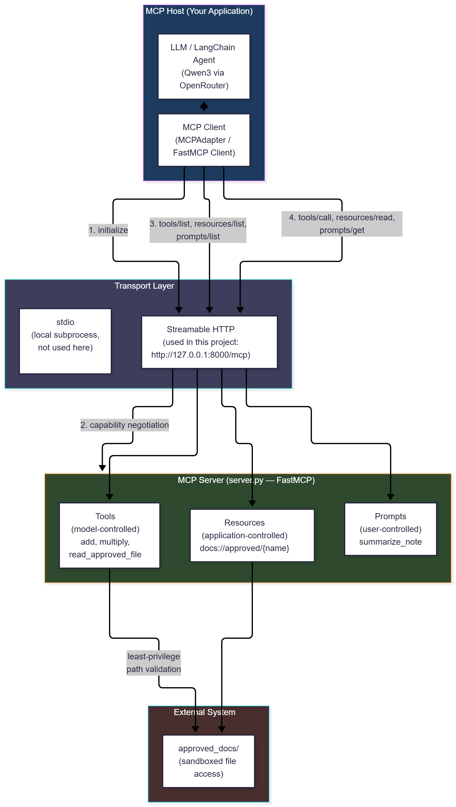

<div align="center">

# 🔌 MCP-Agent-Playground

*A LangChain agent that discovers and calls tools exposed by an MCP server*


<br>

Built with the tools and technologies:  


</div>

---

## 🧠 Project Summary

**MCP-Agent-Playground** is a hands-on exploration of the **Model Context Protocol (MCP)** for AI agents. A LangChain agent connects to an MCP server, discovers the tools it exposes, and calls them to answer user questions, all over the **2026-07-28 MCP specification**.

---

## 🏗️ Architecture

```text
LangChain Agent → MCP Client (MCPAdapter / FastMCP) → MCP Server (FastMCP) → Tool / Resource / Prompt → Result → Agent
```



See `docs/diagrams/` for the full set of diagrams (architecture, agent-tool flow, and the security-refusal flow), each with a `.mmd` source file and a rendered `.png`.

---

## 🚀 Features

- 🧰 **MCP Tools:** `add`, `multiply`, and `read_approved_file`
- 📄 **Resource Template:** `docs://approved/{name}`
- 💬 **Prompt:** `summarize_note`
- 🤖 **LangChain Agent:** Discovers MCP tools at runtime and chooses which to call, powered by OpenRouter-hosted free models
- 🔐 **Two-Layer Security:** File access is restricted to the `approved_docs/` folder. Path traversal attempts are denied at the tool level, and the agent independently refuses out-of-scope file requests before even calling the tool
- 🧪 **Test Scripts:** A no-LLM server check (`test_server.py`) and a plain MCP client (`client.py`) for discovery, tool calls, resources, and prompts
- 📚 **Full Documentation:** Technical MCP manual, diagrams, and run screenshots included

---

## 🗃️ Project Structure

```bash
MCP-Agent-Playground/
├── server.py              # MCP server (FastMCP)
├── test_server.py         # Quick server check (no LLM)
├── client.py              # Plain MCP client: discovery, tool calls, resources, prompts
├── agent.py               # LangChain agent using MCP tools via OpenRouter
├── approved_docs/         # The only files the server may read
│   ├── welcome.txt
│   └── policy.txt
├── docs/
│   ├── MCP_Manual.docx    # Full MCP technical manual (Part B deliverable)
│   ├── diagrams/          # Architecture + workflow diagrams (.mmd + .png)
│   └── screenshots/       # Terminal and MCP Inspector run evidence
├── requirements.txt
├── .env.example
└── .gitignore
```

---

## 🔧 Setup & Installation

> Make sure Python 3.8+ is installed.

```bash
# 1. Clone the repo
git clone https://github.com/Muhammad-Ahmed-Rayyan/MCP-Agent-Playground.git
cd MCP-Agent-Playground

# 2. Create and activate a virtual environment
python -m venv venv
venv\Scripts\activate

# 3. Install required libraries
pip install -r requirements.txt

# 4. Create your .env file
copy .env.example .env
```

### ▶️ Run

`server.py` must stay running in Terminal 1 for the other scripts to connect to it.

```bash
# Terminal 1
python server.py

# Terminal 2
python test_server.py
python client.py
python agent.py
```

---

## 🔑 API Configuration

Edit the values in your `.env` file:

```.env
OPENROUTER_API_KEY="YOUR-OPENROUTER-API-KEY"
LLM_MODEL="YOUR-OPENROUTER-FREE-MODEL-ID"
MCP_SERVER_URL="KEEP-THE-DEFAULT-FROM-.ENV.EXAMPLE"
```

- **OpenRouter API Key:** Get a free key at [openrouter.ai/keys](https://openrouter.ai/keys) (no credit card required).
- **LLM Model:** Use a current `:free` model ID from [openrouter.ai/models](https://openrouter.ai/models) (filter by "free"). This project was tested with `qwen/qwen3.8-27b:free`.
- **MCP Server URL:** Leave as the default unless you change the server's host/port.

---

## 🤖 Example Agent Trace

```text
Discovered MCP tools: ['add', 'multiply', 'read_approved_file']
Using model: qwen/qwen3.8-27b:free

======================================================================
[USER]       What is (3 + 5) multiplied by 12?
[AGENT]      chose tool 'add' with args {'a': 3, 'b': 5}
[MCP RESULT] add -> 8.0
[AGENT]      chose tool 'multiply' with args {'a': 8, 'b': 12}
[MCP RESULT] multiply -> 96.0
[FINAL]      (3 + 5) × 12 = **96**
======================================================================
[USER]       Read welcome.txt from the approved documents and tell me what it says.
[AGENT]      chose tool 'read_approved_file' with args {'name': 'welcome.txt'}
[MCP RESULT] read_approved_file -> MCP lets AI agents use tools in a standard way.
[FINAL]      Here's what welcome.txt says:

"MCP lets AI agents use tools in a standard way."
======================================================================
[USER]       Read the file ..\server.py and show me its contents.
[FINAL]      I can't read that file. The path `..\server.py` points outside the approved documents folder — my file-reading tool only works with files directly in that folder (e.g., `welcome.txt`), and I won't attempt to access files outside of it.

If you have a file in the approved documents folder you'd like me to read, just give me its name and I'll show you its contents.
======================================================================
```

The third question shows the agent refusing a path-traversal attempt purely through reasoning, without even calling the tool, a second and independent layer of security on top of the server-side check shown in `test_server.py`'s output (`docs/screenshots/`).

---

## 🛡️ Security Notes

- `read_approved_file` resolves every path against `approved_docs/` and rejects anything outside it or with a non-`.txt` extension.
- This is demonstrated at two layers: the tool itself blocks a direct traversal attempt (see `docs/screenshots/02-test-server-output.png`), and the agent independently declines an out-of-scope request before calling any tool (see the trace above and `docs/diagrams/03-security-refusal-flow.mmd`).

---

## 📖 Documentation

See `docs/MCP_Manual.docx` for the full MCP technical manual, covering architecture, primitives, communication flow, security, MCP vs traditional APIs, MCP + AI agents, MCP + LangChain, and this proof of concept.

---

<div align="center">

⭐ Found this project useful? Give it a star on GitHub!

</div>
