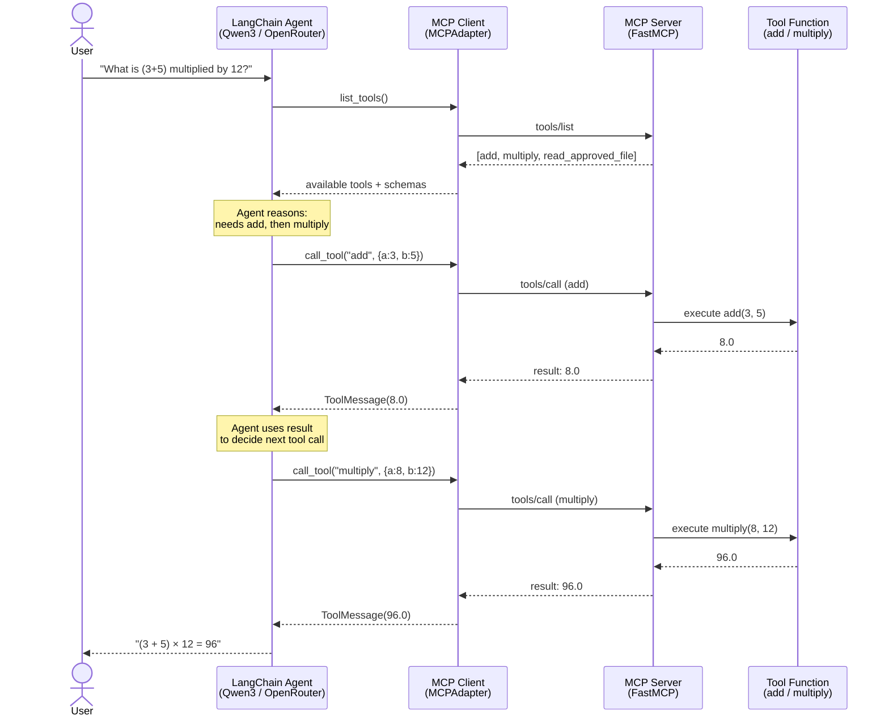

# Agent–Tool Interaction Flow Diagram

## Purpose
Shows the step-by-step message flow for a real run of agent.py,
where the LangChain agent chains two tool calls (add, then multiply)
to answer a multi-step arithmetic question. Traces the full path:
AI Agent -> MCP Client -> MCP Server -> Tool -> Result -> AI Agent.

## Key points
- Corresponds to agent.py, Question 1: "What is (3+5) multiplied by 12?"
- The agent first calls add(3, 5), receives 8.0, then uses that
  result to call multiply(8, 12), receiving 96.0
- Shows the agent discovering tools via list_tools() before any
  reasoning happens
- This exact run is captured in docs/screenshots/05-agent-trace-full.png
  (or 05a-agent-trace-q1-chaining.png if split)

## Diagram

