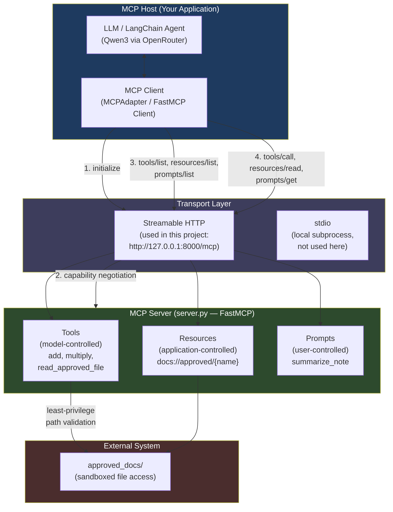

# MCP Architecture Diagram

## Purpose
Shows the relationship between the MCP host, client, server, and the
three MCP primitives (tools, resources, prompts) used in this project,
along with the transport layer connecting them.

## Key points
- Host: this project's LangChain agent (Qwen3 via OpenRouter) plus the
  MCP client (MCPAdapter / FastMCP Client)
- Transport: Streamable HTTP, at http://127.0.0.1:8000/mcp
- Server: server.py, built with FastMCP, exposing 3 tools, 1 resource
  template, and 1 prompt
- Security: tool and resource access is restricted to the
  approved_docs/ folder (least-privilege, path validation)

## Diagram

