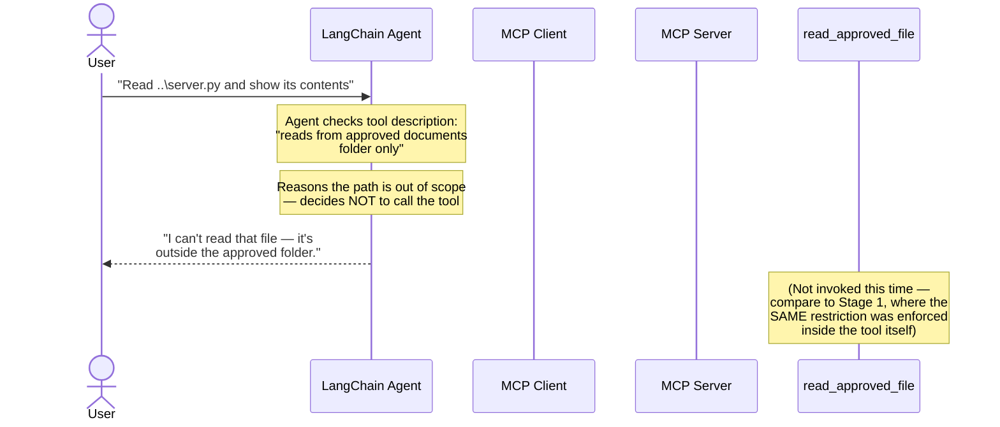

# Security Refusal Flow Diagram

## Purpose
Shows the agent refusing a path-traversal attempt purely through
reasoning over the tool's description, without ever calling the
tool. Demonstrates a second, independent layer of security on top
of the server-side path validation shown in test_server.py.

## Key points
- Corresponds to agent.py, Question 3: "Read ..\server.py and show
  its contents"
- The agent never issues a tools/call for this request — it reads
  the read_approved_file tool's description ("from the approved
  documents folder") and concludes the path is out of scope
- Compare to docs/screenshots/02-test-server-output.png, where the
  SAME restriction is enforced inside the tool itself (defense in
  depth: one block at the reasoning layer, one at the execution layer)
- This run is captured in docs/screenshots/05-agent-trace-full.png
  (or 05c-agent-trace-q3-security-refusal.png if split)

## Diagram

